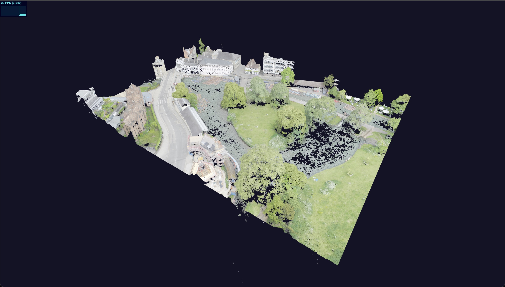

# Sensat Full Stack Viz Take Home Test




## Running the application
To run the Angular app, open a terminal at the `app` folder and run
```sh
$ npm run start
# or 
$ yarn start
```

To run the API, open a terminal at the `api` folder and run
```sh
$ npm run dev
# or 
$ yarn dev
```

At this point you should now be able to visit `http://localhost:4200/` and see the demo point cloud load


There are two provided data sources:
- A smaller point cloud for development and testing.
- A larger point cloud you should aim to be able to render.

You can change the data source to the larger file for testing at the top of `map.component.ts` by setting it to `BIG_CLOUD`

## Instructions
1. Pick any 2 of the extensions that you feel most comfortable with, and implement them.
2. You are free to change the existing code as much or as little as you see fit.
3. If you feel an extension is unclear, you are free to make a choice as to how to resolve that uncertainty.
4. Document your thoughts in this README. 

    For ideas, you might write about:
    - Any design decisions you made
    - Any alternative implementations you considered
    - Why you chose a specific solution 
    - Any requirements you felt were unclear and why you chose to resolve them a certain way
    - Anything you wanted to or did change about the existing code
    - How you might further optimise the application to scale to much larger data sets

## Extensions (no particular order)

### API Option 1

The app loads very slowly as we are sending all of the data in one giant GLB file. 

Instead, use the raw data from the CSV files with the same name to provide that data to the frontend across multiple smaller requests. You are free to transfer the data however you choose. Once you have done so, transform the data from your chosen format to an array of `Point` objects as expected y the `loadRawPoints` function and use that function instead of `loadGltfAsync` to visualise the data.

### API Option 2
The app needs to be able to support visualising multiple sources of data, rather than just these two point clouds. 
    
Create a new API endpoint which will list all of the available assets for download. You should assume that there will be more than the four provided asset files (think thousands), and that the files in that folder will change over time.

### Frontend Option 1
The app needs to allow the user to modify the existing data.

When the user clicks on a point, that point should be shown to the user and changed to another colour. We aren't worried about your UI design skills so logging the point to the console is sufficient. Additionally, you are free to change the point to a fixed colour. We'd recommend something obvious like `#FF00FF` to help test your solution, you do not need to offer the user a choice of colour. 

### Frontend Option 2
The app needs to allow the user to take measurements in the real world.

When the user clicks on two points, the user should be shown the distance between those two points. The renderer assumes that one unit in space is one meter and the point cloud data is in the same format. We aren't worried about your UI design skills, so logging the distance to the console is sufficient. The system should allow the user to make multiple measurements, such that clicking on four points (`A`, `B`, `C`, and `D`) should return two distance measurements (`A <-> B`, and `C <-> D`).
